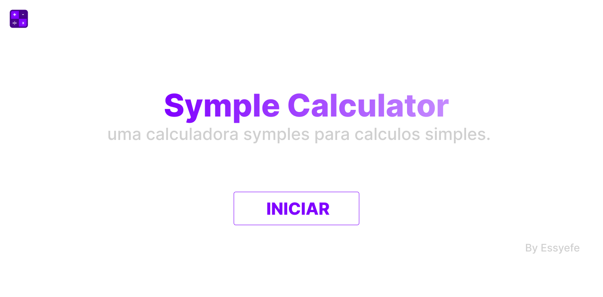
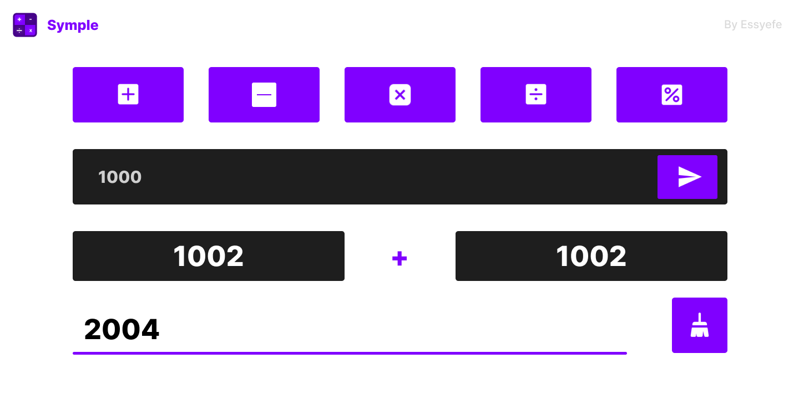
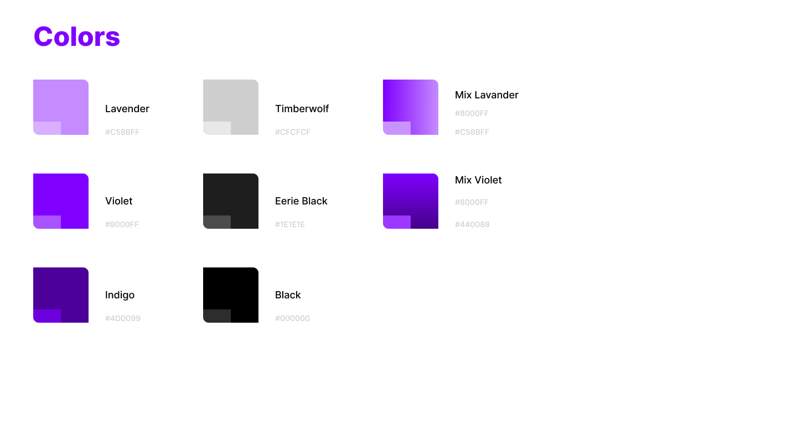
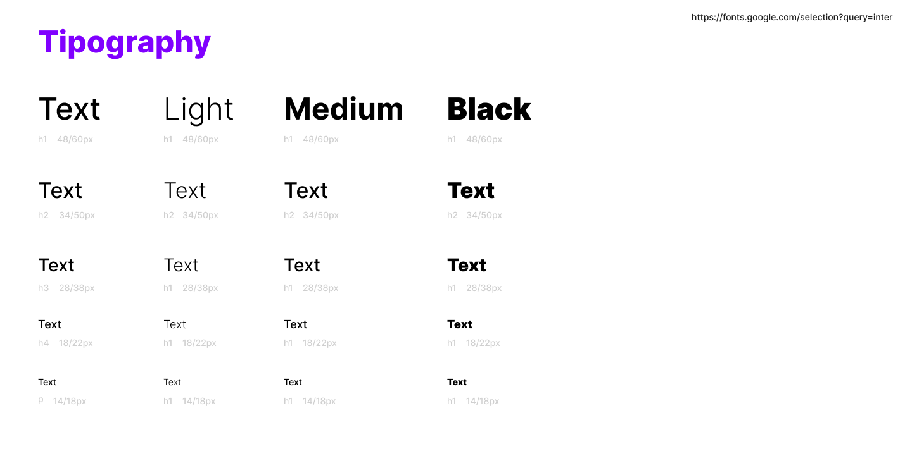

# [Symple Calculator](https://essyefe.github.io/symple-calculator/)
 

---

## Calculadora Simples

O symple calculator é uma calculadora simples com operações de soma, subtração, multiplicação, divisão e porcentagem.

## Conceito

Symple Calculator é uma SPA ( Single Page Application ) o que faz ela ser carregada dinamicamente entre as suas paginas sem precisar de um reload do navegador.

---

